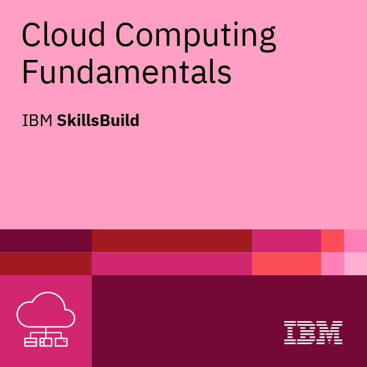

<h1 align="center">- Hi there 👋 I'm Terrance -</h1>

Decoding the mysteries of the web, one line of code at a time! 🚀 With a decade of taming JavaScript, I've earned my cape as a Frontend Superhero and Fullstack Connoisseur.

Senior Fullstack Engineer by day, pixel whisperer by night. I've been bending HTML, CSS, and JavaScript to my will for 10 years, crafting digital experiences that delight and dazzle. 🌟

In a world of semicolons and curly braces, I am the one who brings order. With 10 years under my belt, I turn coffee into code and dreams into digital realities. ☕💻🌈

Code is poetry, and I've been writing sonnets in JavaScript and frameworks for a decade. As a Senior Fullstack Engineer, I blend art and science to create web magic. ✨

Hello World! I've been greeting the web with these words for 10 years as a Senior Fullstack Engineer. Frontend is my playground, backend my sandbox, where I build castles in the cloud. 🏰☁️

             

             

  
    
  

  
    
  

